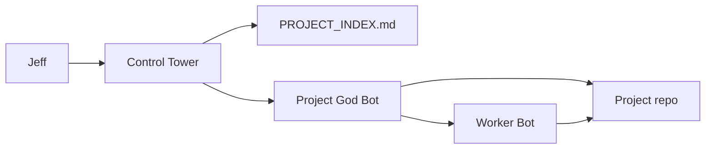

# SETUP GUIDE — Jeff Command Center

How to use this system on **desktop** and **phone**. One brain. Same files.

---

## What lives here

```
C:\Projects\Project Command\AI-COMMAND-CENTER\
├── CONTROL_TOWER.md          ← start every portfolio chat
├── PROJECT_INDEX.md          ← memory / map of all projects
├── PROJECT_GOD_BOT_TEMPLATE.md
├── WORKER_BOTS.md              ← copy-paste narrow tasks
├── SETUP_GUIDE.md              ← this file
└── projects/
    ├── my-bankruptcy.md
    ├── takeoff-pro.md
    └── ... (one God Bot per project)
```

---

## Desktop workflow (Cursor)

### 1. Portfolio / "what should I work on?"

1. Open folder: `C:\Projects\Project Command` (or any project — paths are absolute in docs)
2. New Agent chat
3. Paste:

```
Read AI-COMMAND-CENTER/CONTROL_TOWER.md
Read AI-COMMAND-CENTER/PROJECT_INDEX.md
Jeff wants: [your goal]
Mode: caveman
```

4. Control Tower routes you

### 2. Work on one project

1. **File → Open Folder** → project path from index (example: `C:\Projects\ChapterAI`)
2. New Agent chat
3. Paste:

```
Read C:\Projects\Project Command\AI-COMMAND-CENTER\projects\my-bankruptcy.md
Also read this repo README.md and AGENTS.md if they exist.
Jeff wants: [task]
Mode: caveman
```

4. God Bot runs. For small jobs, append a block from `WORKER_BOTS.md`

### 3. Worker bots

God Bot (or you) picks worker → copy block from `WORKER_BOTS.md` → fill `[BRACKETS]` → send.

Examples:

- Bug → **Fix Worker**
- Ship → **Deploy Worker**
- Webhooks → **Security Worker**

### 4. Pin Control Tower (optional)

- Add `Project Command` to Cursor **Recent** or a dedicated workspace
- Or add user rule: "For portfolio questions, read AI-COMMAND-CENTER/CONTROL_TOWER.md"

---

## Phone / mobile workflow

**Goal:** Same repos on PC and phone. **No duplicate copies.**

### Safest practical setup

| Layer | Recommendation |
|-------|----------------|
| **Source of truth** | Git remote (GitHub) + local `C:\Projects\` on home PC |
| **Phone access** | Cursor mobile/web **or** remote into PC — not a second fork |
| **Before phone session** | Commit + push from desktop (or know what's uncommitted) |
| **During phone session** | Pull on PC side if using sync; small scoped tasks only |
| **After phone session** | Push; desktop pulls before next big edit |

### Option A — Cursor on phone (best when available)

1. Same account as desktop
2. Open repo from cloud/synced workspace if Cursor supports your project remote
3. Start chat with **short** prompt:

```
Read PROJECT_INDEX entry for [project].
Task: [one small thing]
Mode: caveman
```

4. Avoid huge refactors on phone — use **Mobile Handoff Worker** text from desktop first

### Option B — Remote to home PC (most reliable for heavy repos)

1. PC stays on / wakes on LAN (Tailscale, RustDesk, RDP, etc.)
2. Phone connects to **same machine** where `C:\Projects\` lives
3. Cursor on PC via remote — zero sync conflict
4. Edgar project already fits this mental model (office agents + NAS)

### Option C — GitHub-only phone edits (lightweight)

1. Desktop: push branch
2. Phone: GitHub mobile or Codespaces for tiny edits
3. Desktop: pull and verify build
4. **Don't** run two agents on same branch uncommitted

### Mobile handoff ritual (desktop → phone)

Before leaving desk, run **Mobile Handoff Worker** (`WORKER_BOTS.md`) or tell agent:

```
Summarize for phone: branch, files touched, next one step, blockers.
```

Paste summary into phone chat.

### What not to do on phone

- Don't `pnpm install` / full monorepo builds unless desperate
- Don't resolve merge conflicts blind
- Don't rotate secrets
- Don't pick canonical Kepi fork mid-flight without desktop

---

## Control Tower → God Bot → Worker (flow)



1. **Control Tower** — which project? priority?
2. **God Bot** — repo expert, reads README/AGENTS
3. **Worker** — one job, minimal scope

---

## Adding a new project later

1. Scan Worker or manual: note path, stack, README
2. Copy `PROJECT_GOD_BOT_TEMPLATE.md` → `projects/new-slug.md`
3. Fill from repo facts
4. Add row to `PROJECT_INDEX.md`
5. Optional: add row to Control Tower quick-open table

---

## Re-scan all projects

Paste in chat:

```
Scan Worker: scan C:\Projects\ for major software projects.
Update PROJECT_INDEX.md assumptions only where changed.
Mode: caveman.
```

(From `WORKER_BOTS.md`)

---

## Jeff defaults (for any agent)

- Voice: **caveman**
- Optimize: speed, cost, reliability
- Stack bias: TS, React, Next, SQL, Vercel, APIs, AI, PDF
- Don't touch app code unless asked

---

## Troubleshooting

| Problem | Fix |
|---------|-----|
| Agent guesses wrong project | Paste path from `PROJECT_INDEX.md` |
| ChapterAI vs Bankrupty confusion | Pick one canonical; index says ChapterAI first |
| Kepi Travel 3 folders | Default `kepi-travel-reborn` unless Jeff says otherwise |
| Phone out of sync | Stop editing; desktop `git status`; commit or stash; pull/push |
| Agent too verbose | Say "Mode: caveman" again |

---

## First-time checklist

- [ ] Open `Project Command` in Cursor once
- [ ] Skim `PROJECT_INDEX.md`
- [ ] Run one God Bot chat on your current P0 project
- [ ] Ensure Git remotes exist for projects you use on phone
- [ ] Try one Mobile Handoff summary before leaving desk

Done. Command Center ready.
